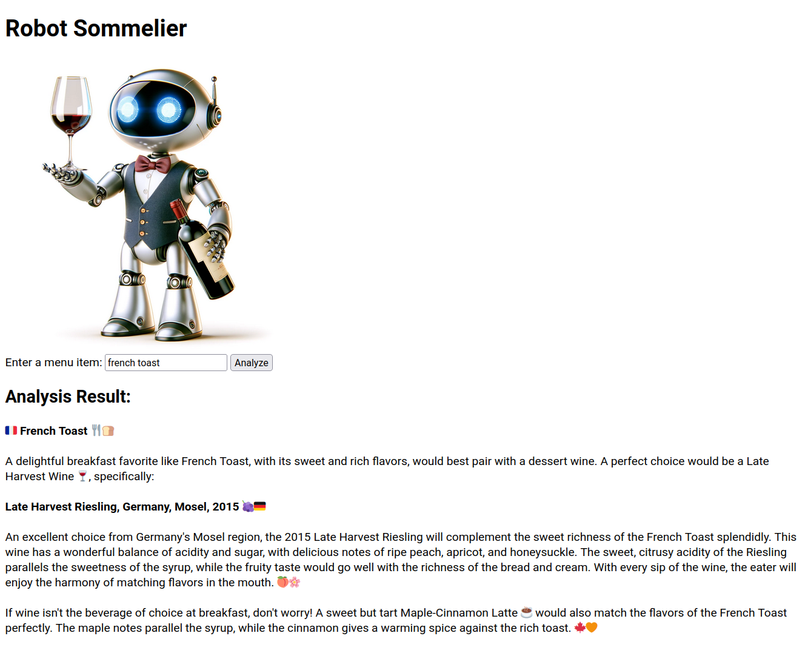

# Sommelier

A simple flask app that connects to the OpenAI API.

# Prerequisites

See [INSTALL.md](./INSTALL.md)

# Running the code

* clone this repository
* ```cd``` to the project directory
* ```bash build-docker-image.sh```
* ```bash run-app.sh```
* visit ```localhost:5000``` from your web browser



# editing

This app is for educational purposes so all of the logic and templating is in the ```app.py``` file, and all of the dependencies are in the ```Dockerfile```. 
